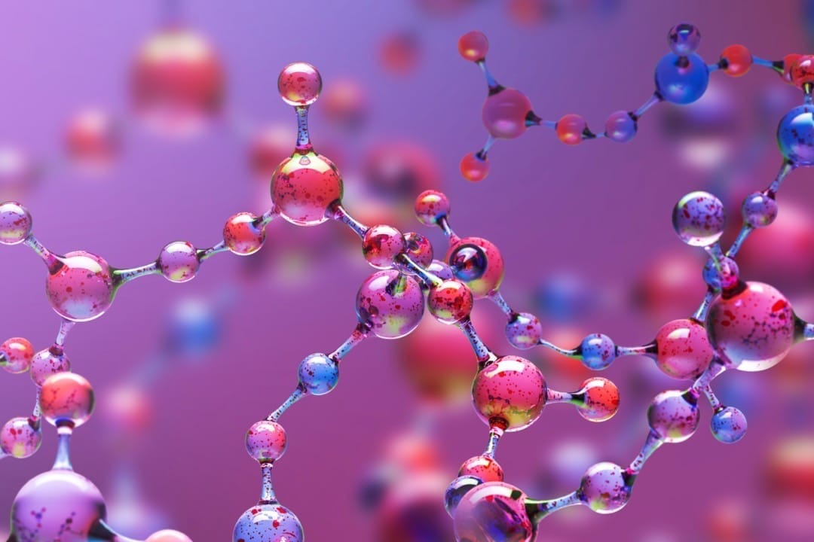

### Foundational Concept 1
# Biomolecules

Biomolecules are the building blocks of life, driving the complex processes that sustain health and enable cellular function. By understanding the structure and function of proteins, nucleic acids, lipids, and carbohydrates, healthcare professionals can better comprehend the biochemical pathways that govern metabolism, genetic expression, and cellular communication. This knowledge is crucial for diagnosing and treating diseases at the molecular level, as it provides insight into how disruptions in biomolecular function can lead to illness.

## Table of Contents
### 