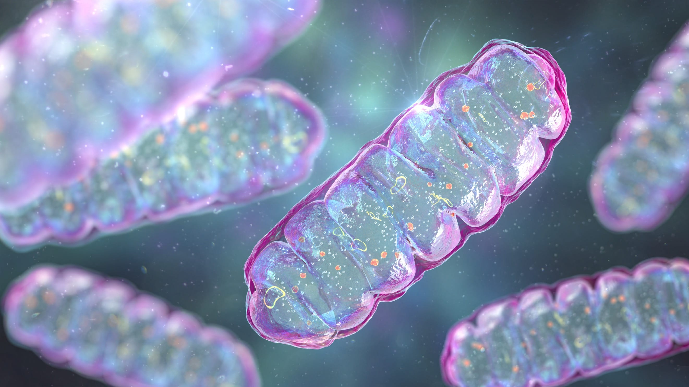

Cells are the fundamental units of life, and their structure and function are central to understanding health and disease. By studying cell biology, healthcare professionals gain insight into the processes of cellular growth, division, metabolism, and communication, which are essential for maintaining bodily functions. This knowledge allows practitioners to recognize how cellular dysfunctions can lead to various diseases, such as cancer, genetic disorders, and infections.

## Table of Contents