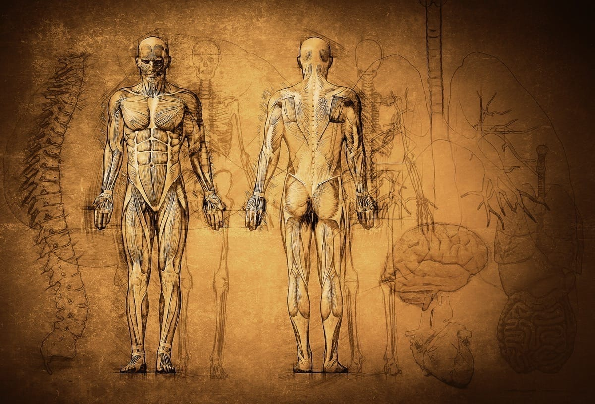

Organs are specialized structures that perform essential functions within the body, each contributing to the overall health and homeostasis of an individual. By understanding the anatomy and physiology of organs such as the heart, lungs, kidneys, and liver, healthcare professionals can diagnose and treat a variety of conditions that arise from organ dysfunction. This knowledge also aids in recognizing how organs work in concert within organ systems, ensuring coordinated bodily functions.

## Table of Contents