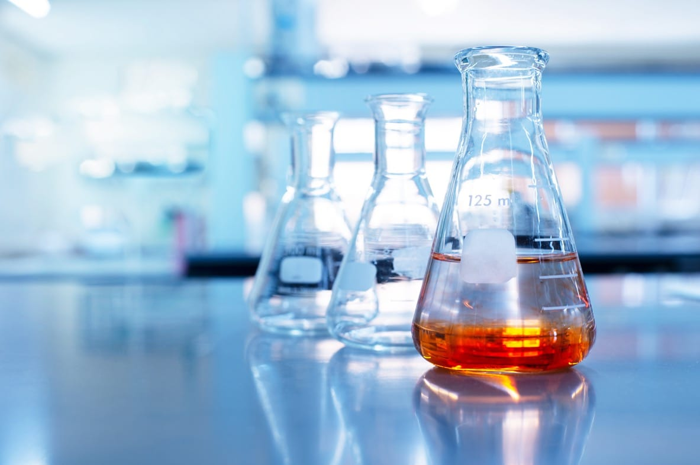

### Foundational Concept 4
# Chemical Proceses

Chemical principles form the foundation for understanding the molecular mechanisms that underpin biological processes. By mastering concepts such as chemical bonding, thermodynamics, and organic chemistry, healthcare professionals can better comprehend how substances interact at the molecular level, influencing everything from drug action to metabolic pathways. This knowledge not only enhances clinical decision-making but also empowers practitioners to contribute to research in medical treatments and therapies.

## Table of Contents