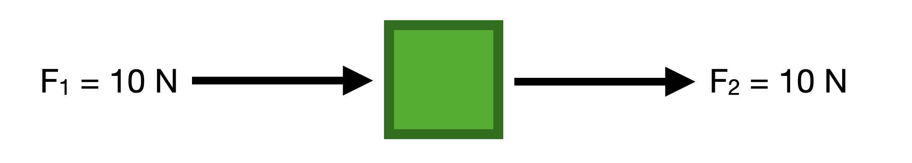
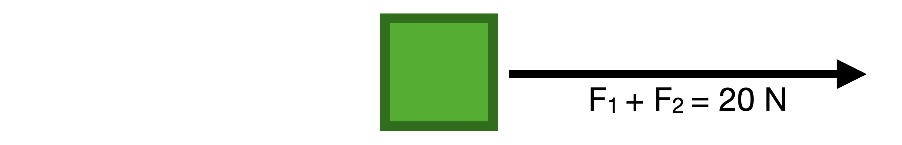
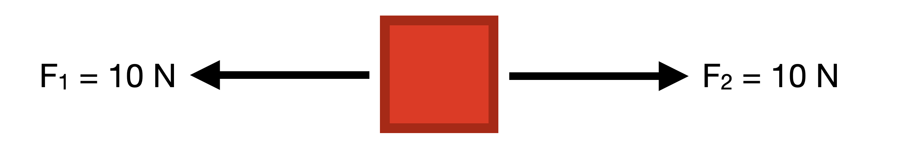

**Vectors** and **scalars** are two different types of quantities used in math and physics. The key difference between the two is that scalar quantities include only a magnitude component while a vector quantity includes both magnitude and direction. Some common examples of scalar and vector quantities can be found in the table below. 

# Common Examples

| Scalars | Vectors |
|-----------|-----------|
| Mass | Velocity |
| Temperature | Displacement |
| Time | Force |

For example, mass is a scalar quantity because it has no direction (something can't have a mass of 10 grams "to the north" or five kilograms "upwards"); however, for a vector quantity we do specify the direction, such as a car having a velocity of 20 km/h to the east, or a ball travelling 5 m/s downwards. 

# Why Does It Matter?
Scalars are simple, they act just like the numbers that we have been adding, subtracting, multiplying, and dividng since elementary school, but vectors don't always follow the same mathematical patterns that we are accustomed to.

> **Example: Scalar Addition**
>
> $$ 10\space g + 10\space g = 20\space g$$

Two objects each with a mass of 10 grams will always combine to have a total mass of 20 grams. However, vectors aren't always as intuitive.

> **Example: Vector Addition**
>
> $$ 10\space N + 10\space N \neq 20\space N$$

Two vectors both with magnitude of 10 Newtons don't always add to a vector with magniude of 20 meters per second. It is possible that they could add to 20 N, but it ultimately *depends on their direction.* The following experiment demonstrates why.

# An Experiment with Vectors
Let's assume that we have a block experiencing two forces, one on each side of the block. 

## Scenario 1
In this scenario, the block experiences two forces (which are vector quantities) labeled $$ F_1 $$ and $$ F_2 $$. Both forces are 10 Newtons in magnitude and they  **point in the same direction** as indicated by the direction of the arrow. 

If we calculate the sum of these two vectors (exactly how to do this is discussed in a later section), then we will find that sum of the two vectors has a magnitude of 20 Newtons and points in the same direction. 

This the simplest example of vector addition, but lets look at what happens if the forces don't point in the same direction as each other. 

## Scenario 2
In this scenario, the block still experiences two forces labeled $$ F_1 $$ and $$ F_2 $$. Both forces are 10 Newtons in magnitude, but this time they  **point in opposite directions**. What is the sum of these two force vectors?

You might be able to answer this intuitively, but if you have two equal and opposite forces acting on the same object, then the object will experience no net force. Even though we are still adding the two vectors together, because of their direction they have completely canceled each other out. 

Problems involving vectors can (and will) get much more complicated than these scenarios. The next section will discuss how to perform mathematical operations with vector quantities.