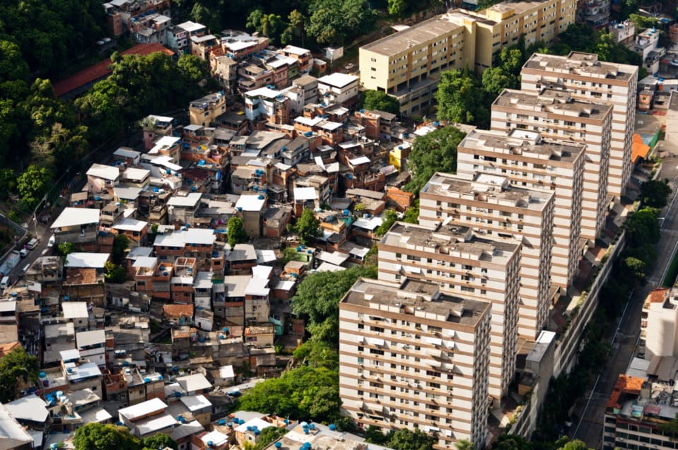

Social inequality encompasses disparities in income, education, access to healthcare, and other resources that are critical to individual and community well-being. By understanding these inequities, healthcare professionals can recognize the broader social contexts that shape patient health, enabling them to provide more empathetic, equitable, and effective care. Additionally, this knowledge equips medical practitioners to advocate for policies and practices that address health disparities beyond just those at the individual patient level, ultimately contributing to a more just and accessible healthcare system.

## Table of Contents
[Introduction to Social Inequality](introduction)

